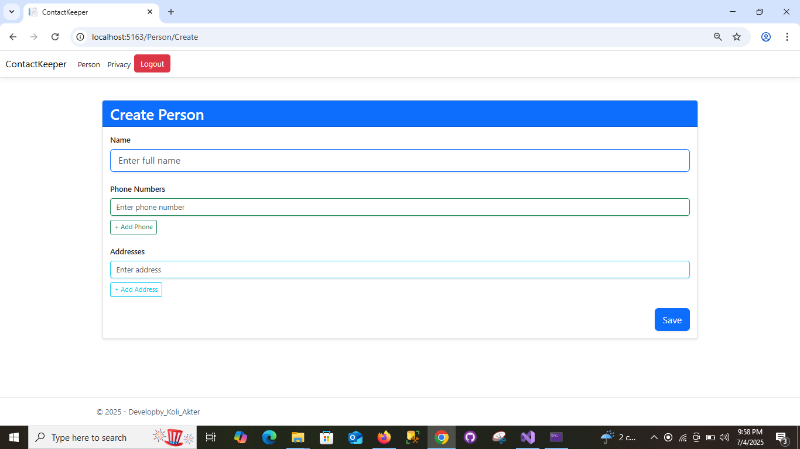
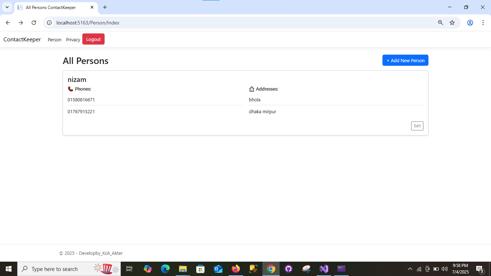
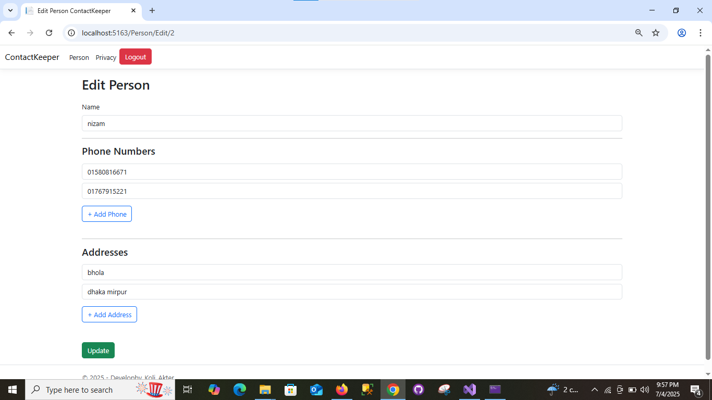

# ContactManager

A secure ASP.NET Core MVC application with JWT Authentication.

## 🔐 Features
- User authentication using JWT tokens
- Create and update person profiles
- Add multiple phone numbers per person
- Add multiple addresses per person

## 🛠️ Technologies Used
- ASP.NET Core MVC
- Entity Framework Core
- SQL Server
- JWT Authentication

## 🚀 Getting Started
1. Clone this repo
2. Update `appsettings.json` with your database connection string
3. Run database migrations
4. Build and run the project

## 📁 Project Structure
- `Controllers/` - API endpoints (e.g., PersonController, AuthController)
- `Models/` - Domain models (Person, Phone, Address, User)
- `Data/` - EF Core DbContext
- `Services/` - JWT generation logic
- `Views/` - Razor views for MVC (if any)

## 📷 Demo Screenshots

### 🧾 Create Person

### 📋 Get All Persons

### ✏️ Update Person

---

Feel free to contribute or open issues for suggestions!
